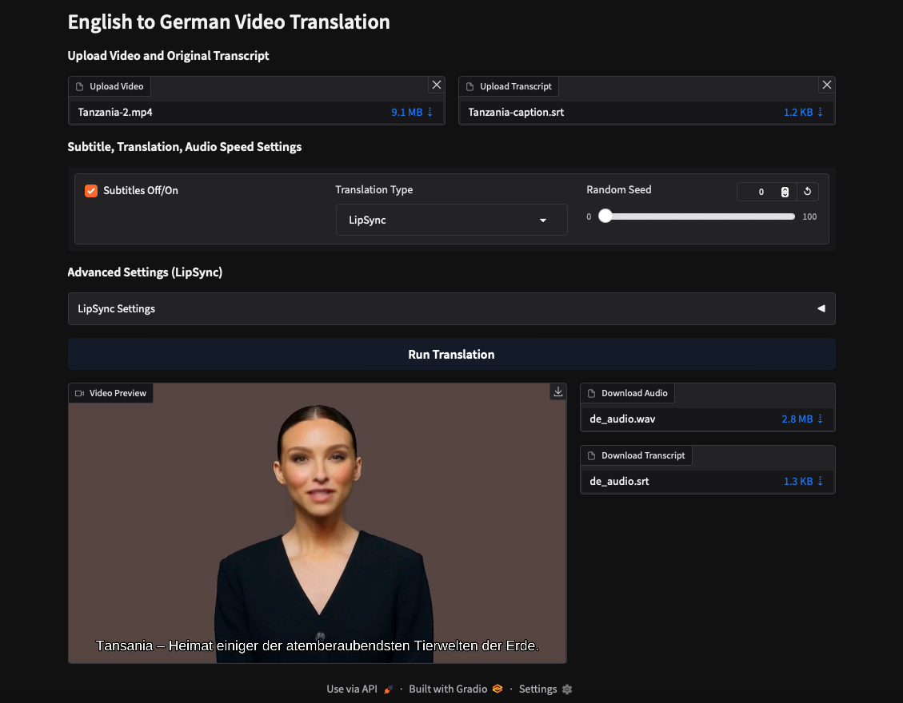

# English to German Video Translation
Gian Mario Favero, September 2025



## Features

1. **Upload Inputs** – Provide an `.mp4` video and matching `.srt` subtitle file for translation.  
2. **Subtitles Toggle** – Choose whether to render subtitles in the final output.  
3. **Translation Type** – Select between:  
   - **Dub** – Simple audio replacement with translated speech.  
   - **Full Lip-Sync** – Uses Wav2Lip models to synchronize lip movements with the translated audio.  
4. **Random Seed** – Set a seed to control generation randomness and reproducibility.  
5. **Advanced Wav2Lip Settings (Optional)**:  
   - Choose a specific Wav2Lip model.  
   - Configure padding for mouth movements.  
   - Adjust processing resize factor for balancing quality and speed.  
6. **Download Outputs**:
   - Download the generated: German transcript (de_audio.srt), German audio (de_audio.wav), or dubbed/lipsynced video (output.mp4).

## Installation

We tested this project on Python ≥ 3.10.
It is recommended to create a fresh virtual environment before installing dependencies.

### 0. Clone the Repository
```bash
git clone https://github.com/faverogian/video-translation.git
cd video-translation
```

### 1. System Requirements

Before installing Python dependencies, make sure you have the following system packages:
- ffmpeg – required for audio/video processing
- espeak-ng – required for some TTS backends
- Python 3.10+
- (Optional, but recommended) CUDA toolkit if you want GPU acceleration with PyTorch

#### macOS
```bash
brew install ffmpeg espeak
```

#### Ubuntu/Debian
```bash
sudo apt update
sudo apt install ffmpeg espeak-ng
```

#### Windows
- Install FFmpeg and add it to your PATH
- Install espeak-ng

### 2. Python Environment
```bash
# Create and activate a virtual environment (Python 3.10+)
python -m venv venv
source venv/bin/activate   # On macOS/Linux
venv\Scripts\activate      # On Windows

# Upgrade pip
pip install --upgrade pip

# Install dependencies
pip install -r requirements.txt
pip install lipsync
```
Note that two `pip install` commands have to be run. There are soft dependency conflicts between `lipsync` and `coqui-tts` that get improperly resolved if all packages are in `requirements.txt`. After running `pip install lipsync`, there will appear to be an error -- this is expected and the code should work as usual.

### 3. Wav2Lip Model Weights Download
This project makes use of the `moshown/lipsync` library for lip dubbing. For full use of the product, we recommend downloading both available models to have some control over generation quality.

1. Download the Wav2Lip model weights: 
    - [wav2lip.pth](https://drive.google.com/file/d/1qKU8HG8dR4nW4LvCqpEYmSy6LLpVkZ21/view?usp=sharing): More accurate synchronization, more blurry output
    - [wav2lip_gan.pth](https://drive.google.com/file/d/13Ktexq-nZOsAxqrTdMh3Q0ntPB3yiBtv/view?usp=sharing): Less accurate synchronization, less blurry output

2. Upload `wav2lip.pth` and `wav2lip_gan.pth` to the `weights/` directory.

## Usage

After installing the dependencies, you can run the Gradio app locally.

### 1. Start the App
```bash
source venv/bin/activate
python main.py
```
By default, Gradio will launch a local server and provide you with a link such as:
```
Running on local URL:  http://127.0.0.1:7860
```
Additionally, there should be a public URL provided. If using a remote/ssh connection, this public URL works without port forwarding.

### 2. Open in Browser

Copy and paste the link into your browser to interact with the app. If using a local machine or port forwarding, use the local URL. Otherwise, use the public URL.

### 3. Interact with the App (See Features)

Processing speed depends on video resolution, length, and machine hardware. For example, full lip synchronization with Wav2Lip on a 1 minute long, 1920×1080 video takes ~5 minutes on a single NVIDIA V100 (16GB). Lower-end GPUs or CPUs will take longer.  

## Pipeline Overview

Our tool converts an English video into a German-dubbed or lip-synced version while preserving timing, naturalness, and original quality. 

GPU is automatically used if available, otherwise the pipeline defaults to a CPU implementation.

1. **Transcript Translation**  
   - We translate the input `.srt` subtitle file from English → German using [Helsinki-NLP/opus-mt-en-de](https://huggingface.co/Helsinki-NLP/opus-mt-en-de) (Transformers implementation from Hugging Face).  
   - Input: English `.srt` file  
   - Output: German `.srt` file with the same timestamps  

2. **Video/Audio Separation**  
   - Using [pydub](https://github.com/jiaaro/pydub), we split the original `.mp4` into separate video and audio tracks for processing.  

3. **Voice Cloning & TTS**  
   - We use the [Coqui XTTS model](https://github.com/coqui-ai/TTS) to first clone the speaker’s voice from the original audio, then generate German audio line by line.  
   - **Synchronization challenges:** TTS can hallucinate (extra words) or produce slower-than-expected speech.  
   - **Correction pipeline:**  
     - We compare TTS output timings with the original subtitle timestamps. Usually, this output is too slow by a little (slow pace of speech) or by a lot (hallucinations).
     - If misaligned, we re-generate the segment, but progressively sped up.  
     - We allow up to 15 retries, keeping the best-aligned sample.  
     - This corrects both hallucinations and slow cadence, ensuring synchronized speech.  

4. **Audio Replacement**  
   - The new German audio is swapped into the original video, replacing the English track.  

5. **Optional Subtitles**  
   - If selected, we overlay the German `.srt` file onto the video.  

6. **Optional Lip Synchronization**  
   - If lip-sync is requested, we use [lipsync](https://github.com/mowshon/lipsync) to adjust mouth movements to match the new German audio.  

7. **Output**
   - Outputs are downloadable via the Gradio application (`de_audio.srt`, `de_audio.wav`, `output.mp4`).

## Limitations

While the tool produces usable German-dubbed and lip-synced videos, there are several limitations to keep in mind:

- **Translation Quality**  
  Transcript translation is handled by a pretrained machine translation model (Helsinki-NLP/opus-mt-en-de). Output may contain errors, unnatural phrasing, or context mismatches depending on the input.  

- **TTS Variability**  
  The Coqui XTTS model sometimes introduces artifacts such as hallucinated words or unnatural prosody. We mitigate this with alignment retries, but quality still varies.  
  - Tip: try generating with different random seeds for more natural results.  

- **Language Mismatch in Timing**  
  Our main priority is keeping the original video un-edited. German typically requires more syllables per second than English, making perfect alignment challenging. 
  - We handle this by speeding up TTS audio when necessary, but this can occasionally sound unnatural.  

- **Lip Synchronization**  
  Lip-sync is powered by the open-source **Wav2Lip** framework. While effective, it is far from perfect:  
  - Lip movements may appear slightly exaggerated, rigid, or unnatural. There is much room for improvement with more advanced or modern lip-sync models. 


- **Performance & Hardware Constraints**  
  Processing speed depends heavily on GPU power. For example, full lip synchronization with Wav2Lip on a **1920×1080 video** takes ~5 minutes on a single **NVIDIA V100 (16GB)**. Lower-end GPUs or CPUs will take longer.   

- **Gradio Bugs**
  Known bug with video preview: sometimes the video will not play. Can be viewed if downloaded.

## Future Work

We envision several improvements to enhance the quality, flexibility, and efficiency of the pipeline:

- **Advanced & Optimized Models**  
  Each stage of the pipeline (translation, TTS, lip-sync) can benefit from more powerful and efficient models.  
  - For example: using large multilingual Transformers for translation, state-of-the-art TTS models for natural prosody, or optimized neural lip-sync models for faster and more accurate mouth movements.  
  - Performing a full **ablation study** would help understand the contribution of each component and identify bottlenecks or quality limitations.  

- **Voice Separation for Complex Audio**  
  Currently, background music or other audio sources are processed along with the speech, which can cause artifacts when dubbing.  
  - Using tools like [Demucs](https://github.com/facebookresearch/demucs) to isolate the speaker’s voice would allow:  
    - Only translating the voice track while preserving background music, sound effects, and ambience.  
    - Cleaner and more natural-sounding dubbed audio for videos with complex soundscapes.  

- **Extended Multi-Language Support**  
  - Support for additional source/target languages beyond English → German.  
  - Integration with multilingual TTS and lip-sync models for consistent pipeline behavior.  

- **Performance Optimizations**  
  - GPU-specific optimizations, mixed-precision inference, or batching strategies for faster processing of long videos.  
  - Potential to reduce memory footprint and processing time for high-resolution or long-form videos.  